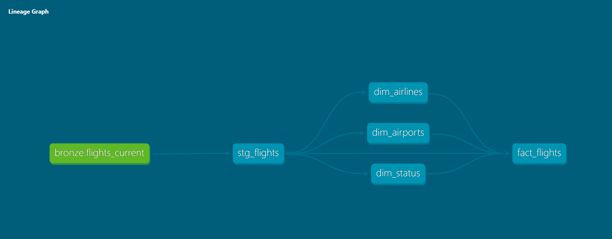
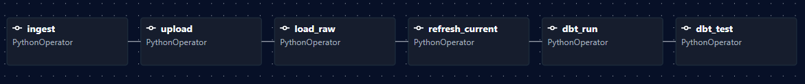

# Flights Data Engineering Pipeline

End-to-end cloud data engineering project that ingests flight data from the Israeli Government Flights API, stores raw data in Azure Data Lake Storage Gen2, processes and models data in Snowflake using dbt, orchestrates workflows with Apache Airflow, and delivers analytics-ready datasets for Tableau dashboards.

---

## Project Goal

The purpose of this project is to demonstrate the design and implementation of a production-style data engineering solution. The project covers the complete data lifecycle, including data ingestion, cloud storage, data warehousing, transformation, orchestration, data quality validation, and analytical modeling using modern data engineering technologies.

---

## Architecture Overview

```text
Data.gov.il Flights API
↓
Python API Ingestion
↓
Azure Data Lake Storage Gen2 (Raw JSON Snapshots)
↓
Snowflake External Stage
↓
Bronze Raw Layer (VARIANT JSON)
↓
Bronze Current Layer (Structured Snapshot)
↓
dbt Silver Layer
↓
dbt Gold Layer (Star Schema)
↓
Airflow Orchestration
↓
Power BI Dashboard

```

---

## Tech Stack

| Category | Technologies |
|-----------|-------------|
| Programming | Python |
| Version Control | Git, GitHub |
| Containerization | Docker |
| Cloud Storage | Azure Data Lake Storage Gen2 (ADLS) |
| Secrets Management | Azure Key Vault |
| Data Warehouse | Snowflake |
| Data Transformation | dbt Core |
| Orchestration | Apache Airflow |
| Data Visualization | Power BI |
| Data Source | Data.gov.il Flights API |

---

## Medallion Architecture & Pipeline Components

### Bronze Layer - Raw Data Ingestion

The Bronze layer captures raw flight data from the Israeli Government Flights API and preserves the original source records for traceability and historical analysis.

Features:

- Extracts flight data from the Data.gov.il Flights API
- Saves raw JSON snapshots using partitioned ingestion folders
- Uploads snapshots to Azure Data Lake Storage Gen2
- Supports incremental snapshot ingestion
- Loads raw JSON data into Snowflake Bronze tables
- Preserves source data without business transformations

### Silver Layer - Data Standardization & Cleansing

The Silver layer transforms raw flight records into a clean, standardized, and analytics-ready dataset using dbt and Snowflake.

Features:

- Built using dbt Core and Snowflake
- Renames source columns using business-friendly naming conventions
- Standardizes data types and string values
- Implements flight deduplication logic
- Selects the latest operational state for each flight
- Documents models and sources using dbt Docs
- Includes automated data quality testing

Business Key:

- airline_code
- flight_number
- scheduled_time
- arrival_departure

## dbt Lineage



### Gold Layer - Dimensional Modeling

The Gold layer applies dimensional modeling principles to create a business-friendly star schema optimized for analytics and reporting.

Features:

- Implements a dimensional star schema
- Builds analytical fact and dimension models
- Generates surrogate keys using dbt_utils
- Enforces referential integrity through relationship tests
- Includes data quality testing for dimensions and facts

Dimensions:

- dim_airlines
- dim_airports
- dim_status

Fact Table:

- fact_flights

## Gold Data Model


### Apache Airflow Orchestration

Apache Airflow orchestrates the end-to-end pipeline and automates the movement and transformation of data across all layers.

Pipeline Tasks:

- Flight data ingestion
- Upload to Azure Data Lake Storage Gen2
- Snowflake Bronze layer loading
- Bronze refresh process
- dbt Silver transformations
- dbt Gold transformations
- Automated data quality testing
- End-to-end workflow orchestration

## Airflow Orchestration




### Project Structure

```text
```text
project/
│
├── airflow/
│   │
│   ├── airflow/
│   │   └── dags/
│   │       └── flights_pipeline.py
│   │
│   ├── python/
│   │   ├── __init__.py
│   │   ├── ingest.py
│   │   ├── key_vault_config.py
│   │   ├── logger_config.py
│   │   └── blob_storage.py
│   │
│   ├── data/
│   │   └── raw/
│   │       └── flights/
│   │
│   ├── docker-compose.yml
│   ├── Dockerfile
│   ├── .env
│   │
│   └── snowflake_sql/
│       ├── SETUP/
│       │   ├── 01_setup.sql
│       │   ├── 02_storage_integration.sql
│       │   ├── 03_stage.sql
│       │   └── 04_create_tables.sql
│       │
│       └── pipelines/
│           ├── load_raw.sql
│           └── refresh_current.sql
│
└── Flights_dbt_proj/
    │
    ├── models/
    │   │
    │   ├── staging/
    │   │   ├── source.yml
    │   │   └── stg_flights.sql
    │   │
    │   ├── marts/
    │   │   ├── dimensions/
    │   │   │   ├── dim_airlines.sql
    │   │   │   ├── dim_airports.sql
    │   │   │   ├── dim_status.sql
    │   │   │   └── dim.yml
    │   │   │
    │   │   └── fact/
    │   │       ├── fact_flights.sql
    │   │       └── facts.yml
    │   │
    │   └── docs/
    │       ├── dimensions.md
    │       └── facts.md
    │
    ├── macros/
    │   └── generate_schema_name.sql
    │
    ├── packages.yml
    └── dbt_project.yml
```

---

## Planned Improvements
- Build Tableau dashboards

---

## Author

Michael Sandrovich
